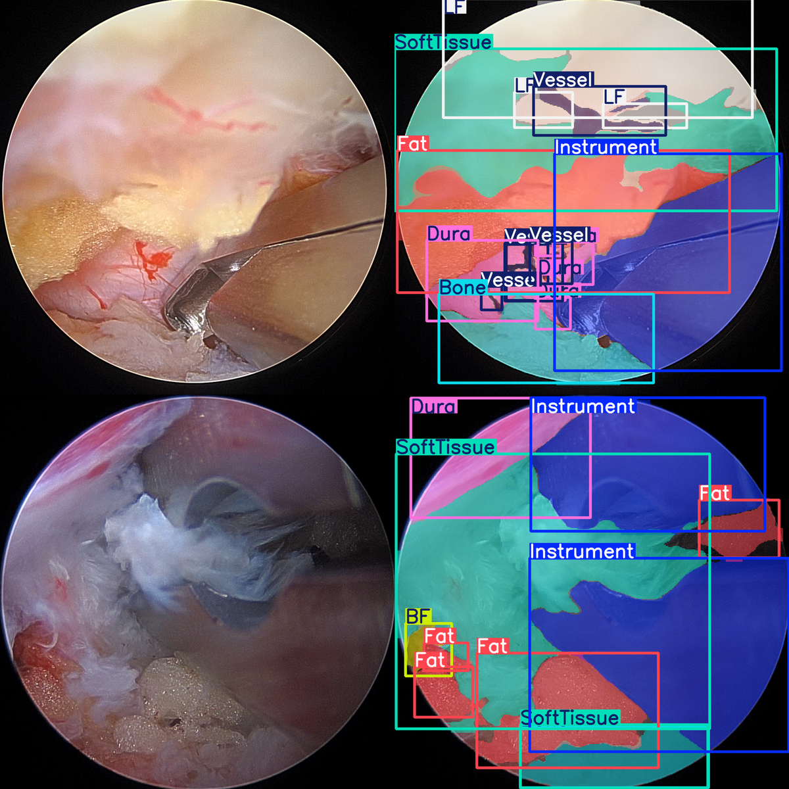
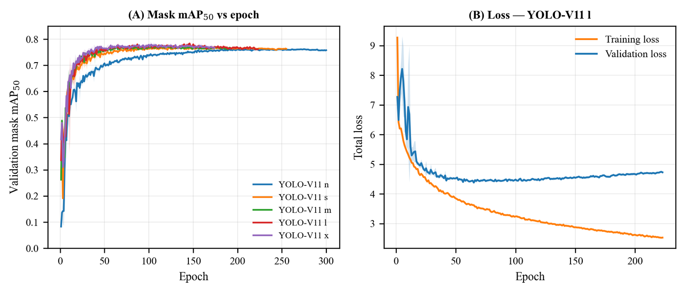

# SpineEndo-YOLO-V11-Seg

Official inference demo for:

> Jung HJ, Nam NE, Lee C, et al.
> **Real-time instance segmentation of spine endoscopy images using a YOLO-V11 deep convolutional neural network**.
> *PLOS ONE*, 2026.

<p align="center">
  
</p>

<p align="center">
  <em>Original endoscopic frame (left) and the model's real-time instance-segmentation
  prediction (right) for representative test frames.</em>
</p>

This repository provides a ready-to-run **inference pipeline** for the YOLO-V11-based
real-time instance-segmentation models described in the paper. It performs
multi-class segmentation of nine spine-endoscopy categories — *Instrument, Bone,
Ligamentum Flavum, Soft Tissue, Vessel, Dura, Fat, Radiofrequency Ablation Wand,*
and *Bleeding Focus* — and lets you run the models on the bundled demo frames
**or on your own spine-endoscopy images and videos**.

The full clinical dataset cannot be shared publicly due to patient privacy and
institutional (IRB) regulations. We instead provide a small de-identified sample in
`test_images/`, pre-packaged trained model weights, and the per-seed metrics behind
the paper’s tables (in `data/`).

---

## Repository structure

```text
spineendo-yolov11-seg/
├── inference_demo.py            # Run inference on images / videos / folders
├── requirements.txt             # Python dependencies
├── test_images/                 # De-identified sample endoscopy frames (test_1 … test_4)
├── data/                        # Per-seed metrics behind the paper’s Tables 2–3
│   ├── metrics_per_seed.csv     #   overall box/mask metrics, latency, FPS (5 variants × 5 seeds)
│   └── per_class_per_seed.csv   #   per-class metrics (5 variants × 5 seeds × 9 classes)
├── example_predictions.png      # Documentation figure
└── weights/
    ├── loader.pyc               # Packaged model loader
    ├── best_n.pt.enc  (+ .meta.txt)
    ├── best_s.pt.enc  (+ .meta.txt)
    ├── best_m.pt.enc  (+ .meta.txt)
    └── best_l.pt.enc  (+ .meta.txt)
    # The YOLO-V11 x weights are not hosted here due to GitHub file-size limits;
    # they can be shared upon reasonable request to the corresponding author.
```

---

## Installation

Tested environment: Python 3.12, PyTorch (CUDA GPU recommended; CPU also works),
Windows 11 / Linux (Ubuntu 22.04).

```bash
git clone https://github.com/HyunD-init/spineendo-yolov11-seg.git
cd spineendo-yolov11-seg

# optional virtual environment
conda create -n spineendo python=3.12 -y
conda activate spineendo

pip install -r requirements.txt
```

---

## Quick start

`inference_demo.py` loads the packaged model(s) and saves annotated results to the
`results/` folder. By default it uses variant **l** (the best speed–accuracy
trade-off). Each run prints an Ultralytics `Speed:` line (preprocess / inference /
postprocess), so you can measure latency on your own hardware.

```bash
# 1) Bundled demo frame
python inference_demo.py

# 2) YOUR OWN image
python inference_demo.py --source path/to/your_frame.jpg

# 3) YOUR OWN endoscopy VIDEO  (an annotated video is written to results/)
python inference_demo.py --source path/to/your_video.mp4

# 4) A folder of images
python inference_demo.py --source path/to/folder

# 5) Pick a variant (n / s / m / l) or run all; choose device
python inference_demo.py --source your_video.mp4 --variant m --device cpu
python inference_demo.py --source your_video.mp4 --variant all
```

**Outputs.** Annotated images or videos are written to `results/<variant>/`.
For a video input, the script produces a fully annotated output video; for images
or folders, it writes one annotated image per input.

> The larger YOLO-V11 x model is not bundled (GitHub file-size limit) and can be
> requested from the corresponding author.

---

## Per-seed metrics (Tables 2–3)

To support statistical reproducibility, the seed-by-seed values underlying the
paper’s tables are provided in `data/`:

* `data/metrics_per_seed.csv` — overall bounding-box and mask metrics (Precision,
  Recall, mAP50, mAP50-95), inference latency, and FPS for every variant
  (n, s, m, l, x) × seed (0–4).
* `data/per_class_per_seed.csv` — the same metrics broken down by the nine classes.

The per-variant mean ± standard deviation reported in Tables 2 and 3 of the paper
can be reproduced directly from these files.

<p align="center">
  
</p>

<p align="center">
  <em>(A) Validation mask mAP50 versus training epoch for the five YOLO-V11 variants
  (n, s, m, l, x). (B) Training and validation loss for YOLO-V11 l. Solid lines denote
  the mean and shaded bands the ± standard deviation across five random seeds (0–4).</em>
</p>

---

## Reproducibility and custom training

Our models use the standard YOLO-V11 segmentation architecture (“YOLOv11-seg”) in
the Ultralytics framework. Researchers can train or fine-tune YOLO-V11-seg on their
own segmentation datasets using the official Ultralytics implementation and the
hyperparameters described in the Methods section of the paper. This repository
focuses on the **inference** pipeline: it provides the trained models in a packaged
format, a simple script to run them on images or video, and detailed timing output
for latency benchmarking.

---

## Data availability

The original clinical videos contain potentially identifiable patient information
and cannot be shared publicly due to institutional and IRB restrictions. This
repository provides a de-identified sample in `test_images/`, the trained models in
a packaged format, and the per-seed metric files in `data/`. Access to the full
dataset may be requested from the corresponding institution’s data access committee,
as described in the Data Availability Statement of the paper.

---

## Citation

If you use this code or these models, please cite:

```text
Jung HJ, Nam NE, Lee C, et al. Real-time instance segmentation of spine endoscopy
images using a YOLO-V11 deep convolutional neural network. PLOS ONE. 2026.
```

*(The final volume/DOI will be added once the article is published.)*
